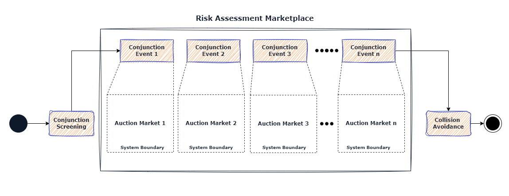

# 🎯 Goals and Constraints

In this section we define the goals and constraints associated with Watchtower and we define the system and its boundary for the engineering model and analysis.

#### Watchtower's mandate is to mitigate the space debris problem and the crowding of orbits in a democratic manner and ensuring censorship resistance. 

## Goals
Watchtower will perform its mandate by ensuring it meets the following goals:

1. Mitigation of any attribute associated with its mandate is transparent.
2. Governance of any attribute associated with its mandate is a democratic process.
3. Censorship resistance is upheld during the processes of mitigation and governance.

## Constraints

1. Mitigation does not imping on privacy.
2. Governance is evolutionary and at times may require a time constrained non-democratic process.

## System Definition

The system under consideration for Watchtower in this engineering model and analysis is at the tournament (or) auction subsystem level. Each conjunction event has its own tournament (or) auction. 

The level above and below the auction subsystem is related to conjunction screening (event detection) and collision avoidance, respectively. Both of which will not be considered in this model and analysis. It is assumed, the conjunction event is screened and resolved for conjunction risk assessment. 

The system boundary encapsulates the auction subsystem. The only information required from conjunction detection is a screened conjunction event to establish the Time of Closest Approach (TCA) which sets the auction's end time. Data going out of the system boundary includes the risk score (Pc) and the threshold, both updated on the conjunctions dashboard for owner/operators to use for a collision avoidance manoeuvre.

 

 